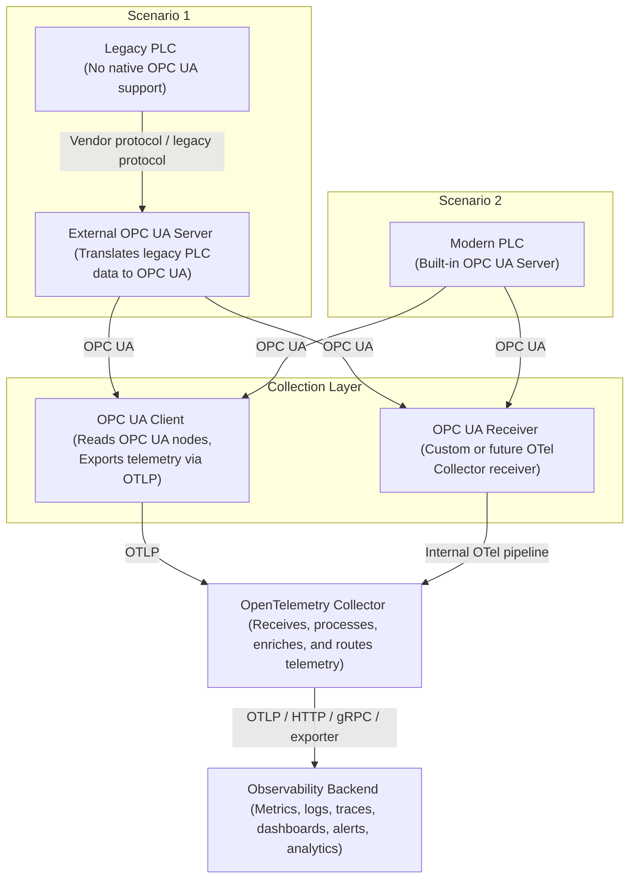

# OPC UA to OpenTelemetry Integration Architecture

## Introduction

This architecture describes a practical approach for integrating OPC UA-based industrial telemetry with OpenTelemetry.

In many manufacturing and legacy environments, plant-floor systems generate valuable operational data, but that data is often difficult to access, normalize, and route into modern observability platforms. Some modern PLCs expose OPC UA natively, while older or legacy PLCs may require an external OPC UA Server or gateway to translate proprietary or legacy protocols into OPC UA.

This reference architecture shows how both scenarios can be connected into a unified OpenTelemetry-based telemetry pipeline.

The architecture supports two common industrial scenarios:

1. Legacy PLC without built-in OPC UA support
2. Modern PLC with built-in OPC UA Server support

In both cases, telemetry can be collected through either:

- An OPC UA Client that reads data from OPC UA Servers and exports telemetry using OTLP
- A future or custom OPC UA Receiver running directly inside the OpenTelemetry Collector

---

## Architecture Goals

The goals of this architecture are to:

- Extract telemetry from industrial systems using OPC UA
- Support both legacy and modern PLC environments
- Avoid disruptive replacement of existing industrial equipment
- Normalize industrial machine data into OpenTelemetry signals
- Centralize telemetry collection through the OpenTelemetry Collector
- Enable routing of telemetry to observability, analytics, monitoring, or security platforms
- Provide a vendor-neutral architecture for industrial observability
- Improve operational visibility across brownfield and legacy environments

---

## Reference Architecture



---

## Scenario 1: Legacy PLC Without OPC UA

In many brownfield environments, existing PLCs do not expose OPC UA natively. These systems may communicate using vendor-specific, serial, Ethernet-based, or older industrial protocols.

In this scenario, an external OPC UA Server or industrial gateway is introduced between the PLC and the observability pipeline.

The external OPC UA Server communicates with the legacy PLC using the protocol supported by the controller. It then exposes selected machine data, process values, status information, and operational signals through an OPC UA address space.

This allows legacy systems to participate in a modern observability architecture without replacing the PLC or modifying the production system directly.

Example data sources may include:

- Machine state
- Sensor values
- Production counters
- Alarm states
- Process variables
- Equipment health indicators

---

## Scenario 2: Modern PLC With Built-in OPC UA

Many modern PLCs and industrial controllers include built-in OPC UA Server functionality.

In this scenario, the OpenTelemetry integration layer can connect directly to the PLC’s native OPC UA Server. This reduces the need for an external gateway and simplifies the telemetry flow.

The PLC exposes relevant operational data through OPC UA nodes. These nodes can then be read by an OPC UA Client or collected by a custom OPC UA Receiver in the OpenTelemetry Collector.

This scenario provides a more direct path from industrial equipment to the observability platform.

---

## OPC UA Client Instrumentation Pattern

One practical approach is to use a lightweight OPC UA Client application. In addition to collecting industrial telemetry, the OPC UA Client itself can also be instrumented with OpenTelemetry to provide visibility into the telemetry collection workflow and protocol interactions.

For example, a Python-based OPC UA Client using libraries such as `asyncua` can be manually instrumented with OpenTelemetry spans around key OPC UA operations including:

- Connecting to the OPC UA Server
- Creating or maintaining sessions
- Browsing the OPC UA address space
- Reading node values
- Handling subscriptions
- Exporting telemetry to the OpenTelemetry Collector
- Disconnecting from the server

This allows operators and engineers to observe not only industrial telemetry, but also the health, latency, reliability, and behavior of the telemetry collection process itself.

Example span names may include:

- `opcua.connect`
- `opcua.read_node`
- `opcua.subscription.callback`
- `opcua.disconnect`
- `otel.export`

Example span attributes may include:

```yaml
opcua.endpoint: opc.tcp://plc-gateway.example.local:4840
opcua.node_id: ns=2;s=Machine.Temperature
opcua.operation: read
machine.id: packaging-machine-07
production.line: line-03
protocol.name: opcua
```

This approach is useful when:

- No native OPC UA Receiver exists in the Collector
- Custom integration logic is required
- Protocol-specific error handling is needed
- The integration must run close to the factory floor or edge environment
- Additional observability into OPC UA communication workflows is required

Example responsibilities of the OPC UA Client include:

- Connecting to OPC UA endpoints
- Browsing or reading OPC UA nodes
- Exporting telemetry to the OpenTelemetry Collector using OTLP
- Emitting telemetry about OPC UA communication and collection workflows

---

## OPC UA Receiver Integration Pattern

A second pattern is to implement an OPC UA Receiver directly inside the OpenTelemetry Collector.

In this model, the Collector connects to OPC UA Servers and collects telemetry directly as part of the Collector pipeline.

At the time of writing, there is no officially supported OPC UA Receiver included in the standard OpenTelemetry Collector distribution. However, community-driven, experimental, and private implementations are already being explored, demonstrating growing interest in bringing industrial telemetry directly into OpenTelemetry-native pipelines.

This approach may be useful when:

- A standardized Collector-based integration is preferred
- Centralized configuration is required
- Multiple OPC UA endpoints need to be managed consistently
- The environment already uses the OpenTelemetry Collector as the primary telemetry gateway
- Long-term maintainability and standardization are important

The OPC UA Receiver could be responsible for:

- Connecting to OPC UA Servers
- Reading configured nodes
- Converting values into OpenTelemetry metrics
- Emitting logs for connection or protocol events
- Supporting secure OPC UA communication
- Applying consistent metadata and resource attributes

---

## OpenTelemetry Collector Role

The OpenTelemetry Collector acts as the central telemetry processing layer.

It receives telemetry from the OPC UA Client or OPC UA Receiver, then processes, enriches, filters, batches, and exports that telemetry to one or more downstream systems.

Common Collector responsibilities include:

- Receiving telemetry through OTLP
- Adding resource attributes
- Filtering noisy or unnecessary signals
- Transforming metric names and labels
- Batching telemetry for efficient export
- Routing telemetry to different backends
- Exporting data to observability, analytics, or monitoring platforms

Example downstream destinations:

- Observability platforms
- Metrics backends
- Log analytics platforms
- Tracing systems
- Data lakes
- Security analytics tools
- Industrial monitoring dashboards

---

## Observability Backend

The observability backend receives processed telemetry from the OpenTelemetry Collector.

This backend may provide:

- Dashboards
- Alerts
- Metrics analysis
- Trace visualization
- Log search
- Machine health views
- Production visibility
- Operational analytics
- Security monitoring

The backend is intentionally shown as generic because this architecture is vendor-neutral. Different organizations may choose different backends depending on their operational, security, analytics, or compliance requirements.

---

## Benefits

This architecture provides several benefits:

- Enables observability for both legacy and modern PLC environments
- Supports brownfield modernization without replacing existing systems
- Uses OPC UA as a standardized industrial interoperability layer
- Uses OpenTelemetry as a vendor-neutral observability standard
- Centralizes telemetry processing through the OpenTelemetry Collector
- Improves troubleshooting and operational awareness
- Creates a foundation for predictive maintenance and industrial analytics
- Reduces dependency on proprietary monitoring silos

---

## Important Considerations

Industrial environments are sensitive and production-critical. Any integration should be carefully designed, tested, and approved before deployment.

Important considerations include:

- Network segmentation between IT and OT environments
- OPC UA security configuration
- Certificate management
- Read-only access where possible
- Load impact on PLCs and gateways
- Polling frequency and data volume
- Change management approval
- Vendor support boundaries
- Safety and operational procedures

This architecture should be validated in a lab or non-production environment before being used in production plant operations.

---

## Summary

This reference architecture demonstrates how OPC UA and OpenTelemetry can work together to improve visibility into industrial and legacy environments.

Legacy PLCs can be integrated through an external OPC UA Server or gateway, while modern PLCs with built-in OPC UA support can be connected directly. Telemetry can then be collected using an OPC UA Client or a custom OPC UA Receiver, routed through the OpenTelemetry Collector, and exported to an observability backend.

The result is a flexible, vendor-neutral approach for bringing modern observability practices to traditional industrial systems.