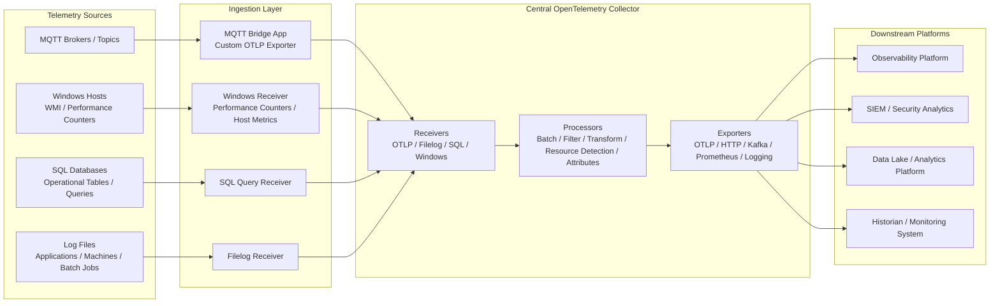

# Unified Telemetry Pipeline Architecture

This reference architecture demonstrates how different telemetry sources in traditional, hybrid, and legacy environments can be integrated into a centralized OpenTelemetry Collector pipeline.

The goal is to normalize data from multiple source types — including MQTT messages, Windows WMI / performance counters, SQL databases, and log files — and route them through a common telemetry processing layer before export to observability, analytics, monitoring, SIEM, or data platform backends.

## Architectural Goal

Many legacy and industrial environments generate useful operational data, but that data is often fragmented across different protocols, systems, and formats. Some data may come from MQTT topics, some from Windows hosts, some from SQL queries, and some from application or machine log files.

This architecture uses the OpenTelemetry Collector as a central telemetry gateway that can receive, process, enrich, transform, and export this data in a consistent way.

## Reference Architecture

## Architecture Description

In this model, the OpenTelemetry Collector acts as a centralized telemetry processing layer. Instead of sending each data source directly to a separate backend, different telemetry inputs are first routed into a common Collector pipeline.

MQTT messages can be consumed by a lightweight bridge application that subscribes to selected topics, converts payloads into OpenTelemetry metrics or logs, and exports them to the Collector using OTLP. This pattern is useful when MQTT payloads are domain-specific and require custom parsing or enrichment before they can become useful telemetry.

Windows telemetry can be collected from Windows hosts using Collector receivers that expose system, service, or performance-counter data. In environments where WMI is already used operationally, similar data can be mapped into OpenTelemetry metrics through Windows performance counters, host metrics, or custom collection logic.

SQL-based telemetry can be extracted using query-based collection patterns. This is useful when important operational state is stored in database tables, such as machine status, job execution results, batch processing records, production counters, or application health indicators.

Log files can be collected using the Filelog Receiver and converted into structured OpenTelemetry logs. This is especially valuable in legacy environments where applications write diagnostic, operational, or machine-event data only to local files.

Once telemetry reaches the Collector, processors can be used to normalize attributes, add environment metadata, filter noisy signals, transform field names, batch data efficiently, and prepare telemetry for downstream systems.

## Example Data Source Mapping

| Source Type | Example Data | Integration Pattern | OpenTelemetry Signal |
|---|---|---|---|
| MQTT | Sensor readings, machine events, line status | MQTT bridge app exporting OTLP | Metrics / Logs |
| Windows WMI / Counters | CPU, memory, services, process health, custom counters | Windows receiver or custom collector logic | Metrics |
| SQL | Job status, production counts, batch results, application state | SQL query receiver | Metrics / Logs |
| Log files | Application logs, machine logs, batch job output | Filelog receiver | Logs |

## Why This Architecture Matters

This pattern is useful for environments where direct instrumentation is not always possible. Many traditional systems cannot be modified, upgraded, or instrumented with modern SDKs. However, they often expose valuable telemetry indirectly through databases, log files, message brokers, operating system counters, or protocol gateways.

By routing these signals into a unified OpenTelemetry pipeline, organizations can improve visibility without replacing existing systems or disrupting production environments.

The key idea is that partial visibility is often significantly better than no visibility. Even when full code-level instrumentation is not available, telemetry can still be extracted, normalized, and used for monitoring, alerting, analytics, and operational decision-making.

## Design Notes

This architecture is intentionally vendor-neutral. The OpenTelemetry Collector provides the central processing layer, while source-specific integrations can be implemented using existing receivers, community receivers, custom receivers, or lightweight bridge applications.

For sources that do not have a mature Collector-native receiver, a bridge service can be used. The bridge is responsible for connecting to the source system, parsing the native data format, mapping values into OpenTelemetry semantic structures where possible, and exporting the result to the Collector using OTLP.

This allows legacy and industrial environments to adopt OpenTelemetry incrementally, starting with the data sources that are easiest to access and expanding over time as more integrations become available.

## Useful References

### OpenTelemetry

- OpenTelemetry Project  
  https://opentelemetry.io/

- OpenTelemetry Collector  
  https://opentelemetry.io/docs/collector/

- OpenTelemetry Collector Contrib  
  https://github.com/open-telemetry/opentelemetry-collector-contrib

### Collector Receivers & Integrations

- Filelog Receiver  
  https://github.com/open-telemetry/opentelemetry-collector-contrib/tree/main/receiver/filelogreceiver

- SQL Query Receiver  
  https://github.com/open-telemetry/opentelemetry-collector-contrib/tree/main/receiver/sqlqueryreceiver

- Host Metrics Receiver  
  https://github.com/open-telemetry/opentelemetry-collector-contrib/tree/main/receiver/hostmetricsreceiver

- Windows Performance Counters Receiver  
  https://github.com/open-telemetry/opentelemetry-collector-contrib/tree/main/receiver/windowsperfcountersreceiver

### Messaging & Data Sources

- MQTT Specification  
  https://mqtt.org/

- Microsoft WMI Documentation  
  https://learn.microsoft.com/en-us/windows/win32/wmisdk/wmi-start-page

- OpenTelemetry Semantic Conventions  
  https://opentelemetry.io/docs/specs/semconv/