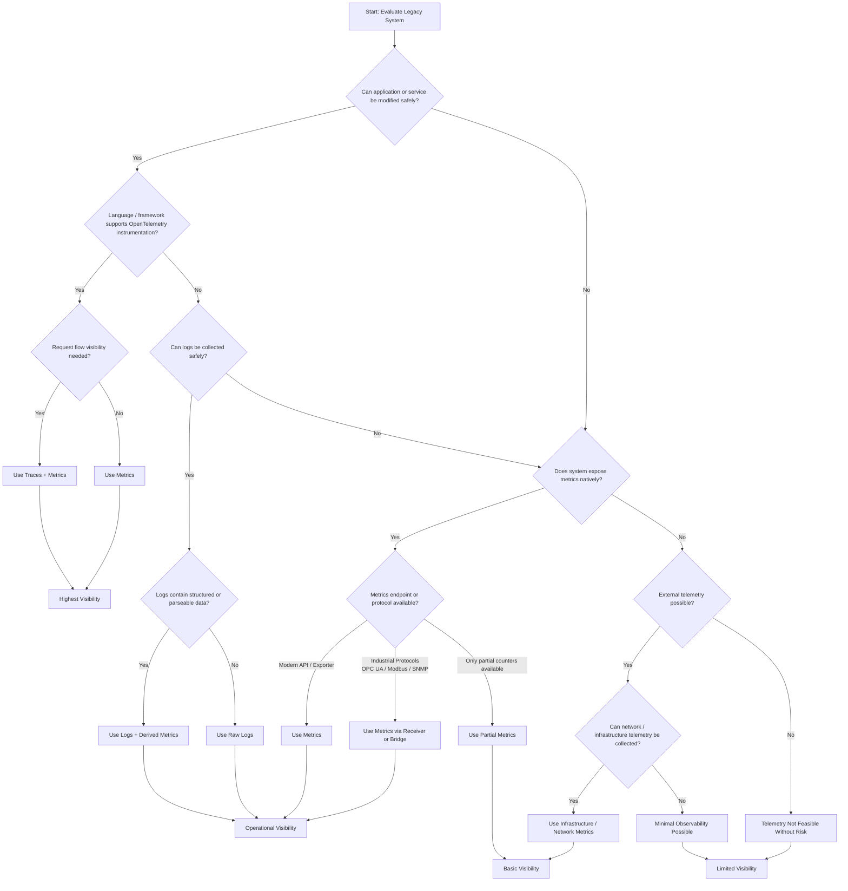

# Legacy Environment Signal Selection Decision Tree

## 🎯 Purpose

Selecting the correct telemetry signal in legacy and industrial environments is often significantly more challenging than in modern cloud-native systems.

Unlike modern applications, legacy systems frequently have:

- Limited instrumentation support
- Restricted modification policies
- Proprietary protocols
- Minimal APIs
- Performance-sensitive workloads
- Vendor-controlled software
- Security and compliance limitations
- Mission-critical uptime requirements

Because of this, telemetry strategies must often adapt to what is realistically available rather than what is theoretically ideal.

This decision tree provides a pragmatic framework for determining whether **metrics**, **logs**, or **traces** should be prioritized in traditional and legacy environments.

---

# 🧭 Signal Selection Decision Tree

---

# 📊 Signal Selection Philosophy

## Metrics

Metrics are typically the safest and most practical signal in legacy environments.

They are often preferred because they:

- Have lower overhead
- Are easier to store and analyze
- Require less system modification
- Work well for dashboards and alerting
- Can often be extracted externally

Typical examples:

- CPU utilization
- Memory usage
- Machine states
- PLC counters
- Production throughput
- Error counters
- OPC UA values
- SNMP telemetry
- Network statistics
- Temperature or sensor values

Metrics are usually the best first step when introducing observability into operational technology (OT) or manufacturing environments.

### Common Metric Sources

| Source Type | Example |
|---|---|
| Infrastructure | CPU, memory, disk |
| Industrial Protocols | OPC UA, Modbus |
| Network Devices | SNMP |
| OT Gateways | MQTT metrics |
| PLCs | Production counters |
| Historians | Aggregated process values |

---

## Logs

Logs become important when:

- Application instrumentation is unavailable
- Systems already generate operational logs
- Legacy applications expose meaningful text events
- Metrics cannot be extracted directly
- Vendor systems only expose text-based diagnostics

In many environments, logs are the only accessible telemetry source.

Structured or semi-structured logs can often be transformed into:

- Metrics
- Alerts
- State transitions
- Error rate indicators
- Availability indicators

This is especially common in:

- Windows-based legacy applications
- Industrial middleware
- Historian platforms
- MES systems
- Proprietary vendor software
- SCADA systems

### Typical Log Sources

| Source | Example |
|---|---|
| Windows Event Logs | Service failures |
| MES Platforms | Workflow events |
| Historian Software | Data collection errors |
| Industrial Applications | Operator events |
| Custom Scripts | Batch processing logs |
| Syslog Devices | Infrastructure alerts |

---

## Traces

Distributed tracing is usually the most difficult signal to implement in legacy environments.

Tracing may only be realistic when:

- Source code modifications are allowed
- Modern languages/frameworks are used
- OpenTelemetry instrumentation exists
- Latency and transaction visibility are required
- Modern APIs are already present

Examples where tracing may still be practical:

- Modern OPC UA gateway applications
- MQTT bridge services
- Custom middleware
- API translation layers
- Manufacturing data platforms
- Edge computing applications

In many traditional environments, traces are introduced gradually around the edges of legacy systems rather than directly inside them.

### Typical Tracing Candidates

| Component | Tracing Feasibility |
|---|---|
| Modern Python Services | High |
| Java Middleware | High |
| Legacy PLCs | Very Low |
| Proprietary Appliances | Very Low |
| MQTT Brokers | Medium |
| Edge Gateways | Medium to High |

---

# ⚖️ Key Principle

A critical principle in legacy modernization is:

> Partial visibility is often significantly better than no visibility.

Organizations frequently delay observability initiatives while pursuing ideal instrumentation that may never become feasible in legacy or operational technology environments.

In practice, operational improvements can often be achieved through:

- Basic metrics
- Log-derived telemetry
- Infrastructure monitoring
- External protocol collection
- Incremental instrumentation

Even limited telemetry can dramatically improve:

- Incident response
- Operational awareness
- Capacity planning
- Security visibility
- Reliability engineering
- Predictive maintenance initiatives

---

# 🔐 Additional Considerations

Telemetry selection should also account for:

- Safety constraints
- Vendor support agreements
- Security restrictions
- Network segmentation
- Air-gapped environments
- Performance sensitivity
- Regulatory requirements
- Maintenance windows
- Operational risk tolerance

In some environments, non-invasive telemetry collection may be the only acceptable approach.

---

## ⚠️ Disclaimer

This decision tree is intended as a high-level architectural and operational guidance framework. Actual telemetry strategies should be validated against organizational security policies, operational requirements, vendor support agreements, safety considerations, and performance constraints before implementation.