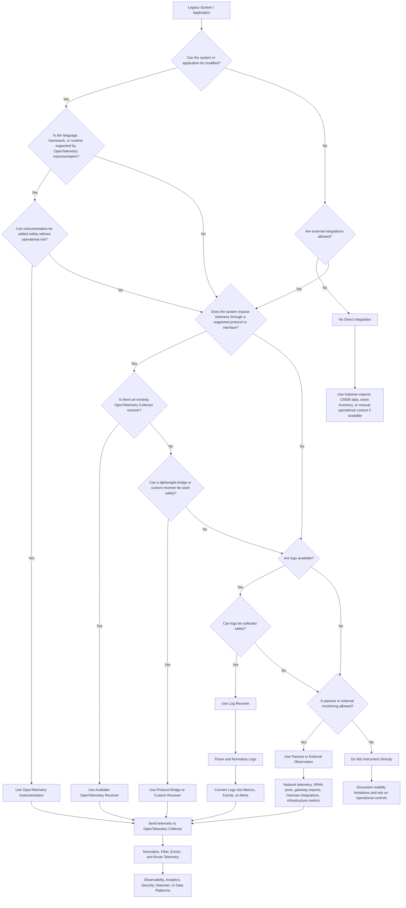

# Legacy Telemetry Integration Decision Tree

## Overview

Modern observability platforms often assume applications can be instrumented directly using OpenTelemetry SDKs, auto-instrumentation agents, or native integrations. In legacy and industrial environments, this is frequently not possible.

Many operational technology (OT), manufacturing, and legacy IT systems were not designed with modern telemetry standards in mind. Systems may be vendor-managed, closed-source, safety-certified, unsupported, or considered too critical to modify. In other cases, OpenTelemetry instrumentation may not exist for the language, framework, protocol, or runtime being used.

This decision tree provides a practical framework for determining the safest and most effective telemetry integration strategy for legacy environments.

The goal is not necessarily perfect observability. In many industrial and mission-critical systems, partial visibility obtained safely is significantly more valuable than introducing operational risk through invasive instrumentation.

---

# 🎯 Architectural Goals

- Determine whether direct OpenTelemetry instrumentation is feasible
- Verify whether the target language, runtime, framework, or library is supported by OpenTelemetry instrumentation
- Identify safe telemetry integration approaches for mission-critical or vendor-managed systems
- Reuse existing OpenTelemetry Collector receivers whenever possible
- Support environments where only logs or external telemetry are available
- Minimize operational and security risk
- Enable gradual modernization and telemetry standardization
- Centralize telemetry collection and normalization through OpenTelemetry Collector pipelines

---

# 🏗️ Legacy Telemetry Integration Decision Tree

---

# 🔍 Decision Areas Explained

## 1. OpenTelemetry Instrumentation

Direct OpenTelemetry instrumentation is typically preferred when:

- The application can be modified safely
- Source code or deployment control is available
- The language or framework is supported
- Instrumentation does not introduce unacceptable operational risk

Examples include:

- Java applications using OpenTelemetry Java Agent
- Python services instrumented with OpenTelemetry SDK
- .NET applications using OpenTelemetry .NET libraries
- Node.js applications with OpenTelemetry auto-instrumentation

In industrial environments, instrumentation feasibility often depends on:

- Vendor policies
- Certification boundaries
- Maintenance windows
- Runtime limitations
- Unsupported frameworks or proprietary runtimes

Even when code modifications are technically possible, unsupported languages or proprietary frameworks may require alternative approaches.

---

## 2. Existing OpenTelemetry Collector Receivers

If direct instrumentation is not possible, the next option is to determine whether telemetry can be collected through existing OpenTelemetry Collector receivers.

Examples include:

- SNMP Receiver
- SQL Query Receiver
- Host Metrics Receiver
- Prometheus Receiver
- Syslog Receiver
- Kafka Receiver
- Filelog Receiver

This approach is often safer because telemetry collection happens externally without modifying the monitored system itself.

---

## 3. Protocol Bridges or Custom Receivers

Many industrial protocols currently lack mature or officially maintained OpenTelemetry Collector receivers.

In these cases, lightweight integration layers may be used to:

- Read telemetry from industrial protocols
- Normalize data into OpenTelemetry telemetry
- Export telemetry via OTLP

This pattern is especially useful in manufacturing environments where standardized telemetry pipelines are required but native OpenTelemetry support is limited.

---

## 4. Log Collection and Log-to-Metric Conversion

Some legacy systems expose only logs.

In these environments:

- Logs can be collected using file-based or syslog receivers
- Structured or semi-structured logs can be parsed
- Metrics, alerts, or operational events can be derived from logs

Examples include:

- PLC event logs
- Windows Event Logs
- Application text logs
- Historian export logs
- SCADA operational logs

This approach provides partial visibility even when metrics APIs or instrumentation are unavailable.

---

## 5. Passive or External Observation

Some mission-critical systems prohibit any direct interaction.

In these cases, telemetry may still be obtained indirectly through:

- Network monitoring
- SPAN/TAP traffic analysis
- Infrastructure telemetry
- Gateway exports
- Existing historians
- Read-only monitoring systems

This approach minimizes operational impact while still providing situational awareness.

---

## 6. No Safe Telemetry Path

In certain environments:

- Security policy may prohibit telemetry extraction
- Vendor contracts may forbid modifications
- Regulatory or certification constraints may apply
- Operational risk may outweigh telemetry value

In those cases, the correct architectural decision may be to avoid direct telemetry integration entirely.

Instead, teams should:

- Document visibility limitations
- Use compensating operational controls
- Monitor surrounding infrastructure where possible
- Reevaluate integration opportunities during future modernization efforts

---

# 📌 Key Principles

## Safe visibility is better than unsafe visibility

In industrial and mission-critical environments, telemetry collection must never compromise operational stability or safety.

---

## Partial telemetry is still valuable

Even limited telemetry can improve:

- Incident response
- Operational awareness
- Security monitoring
- Capacity planning
- Predictive maintenance

---

## Standardization matters

Even when telemetry originates from diverse legacy systems, normalizing data into OpenTelemetry pipelines simplifies downstream analytics, routing, and observability.

---

## OpenTelemetry adoption is evolutionary

Legacy modernization is rarely immediate. Organizations often progress through multiple stages:

1. Passive observation
2. Log collection
3. External protocol integrations
4. Collector receivers
5. Partial instrumentation
6. Full native telemetry adoption

The decision tree helps organizations choose the safest and most realistic step for their environment today.

---

# ⚠️ Important Considerations

## Mission-Critical Systems

Industrial systems often control physical processes where downtime may impact:

- Worker safety
- Product quality
- Production continuity
- Regulatory compliance

Telemetry integration strategies must always prioritize operational stability over observability depth.

---

## Vendor and Certification Constraints

Many legacy platforms are:

- Closed-source
- Vendor-managed
- Safety-certified
- No longer actively maintained

Direct instrumentation may violate support agreements or certification boundaries.

---

## Security Restrictions

Some environments intentionally restrict:

- Outbound telemetry
- Agent installation
- Runtime modifications
- Network access
- External integrations

In these environments, passive or indirect visibility approaches may be the only viable option.

---

# 🛡️ Disclaimer

This document provides a high-level architectural and strategic reference intended for educational, research, and design discussion purposes only. Actual integration approaches for legacy, industrial, or mission-critical systems should always be validated against vendor guidance, operational requirements, cybersecurity policies, regulatory obligations, and internal change management procedures before implementation.

Telemetry collection methods, instrumentation approaches, protocol integrations, and monitoring architectures may introduce operational, performance, security, or compliance risks if applied incorrectly. All modifications, integrations, and deployment decisions should be thoroughly tested and reviewed within the context of the target environment.

The examples and architectural patterns presented here are vendor-neutral and intended to demonstrate possible modernization and observability approaches rather than prescribe a single implementation model.